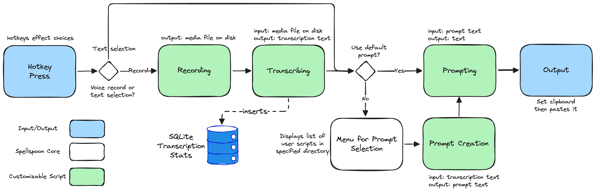

# Spellspoon

Spellspoon is a macOS tool built using Hammerspoon that enables hotkey-driven audio recording, transcription, and text processing. It provides an efficient way to transcribe voice input and optionally apply customizable prompts to manipulate text before copying it to the clipboard and pasting it directly.

## Demo

https://github.com/user-attachments/assets/34420500-bd55-4297-a52c-1321ea521650

## Features

- Hotkey-based recording and transcription.
- Customizable shell script pipelines for recording, transcribing, and prompting.
- Flexible text transformation via prompts.
- Supports clipboard copying and direct pasting.
- Tracks transcription statistics (duration, word count, character count).
- Compatible with local and third-party transcription services.

## Installation

First, have [Hammerspoon](https://www.hammerspoon.org/) installed.

Clone the repository and place the `spellspoon.spoon` directory inside `~/.hammerspoon/Spoons/`:

```sh
git clone https://github.com/kevinjalbert/spellspoon.git ~/.hammerspoon/Spoons/spellspoon.spoon
```

## Configuration

Example setup in Hammerspoon:

```lua
local spellspoon = hs.loadSpoon("spellspoon")

spellspoon:setConfig({
    promptsDirectory = "~/.spellspoon/prompts",
    transcriptionStatsDatabase = "~/.spellspoon/transcription_stats.sqlite",
    transcribingScript = "~/.spellspoon/transcribing.sh",
    recordingScript = "~/.spellspoon/recording.sh",
    promptingScript = "~/.spellspoon/prompting.sh",
    logLevel = "debug"
})

spellspoon:bindHotkeys({
    recordWithDefaultPrompt = {{"cmd", "alt", "ctrl", "shift"}, "["},
    recordWithPromptSelection = {{"cmd", "alt", "ctrl", "shift"}, "]"},
    recordWithoutPrompt = {{"cmd", "alt", "ctrl", "shift"}, ";"},
    useSelectedTextWithPromptSelection = {{"cmd", "alt", "ctrl", "shift"}, "="},
    showStatsModal = {{"cmd", "alt", "ctrl", "shift"}, "-"}
})
```

## High-level Overview



## Customization

Spellspoon is highly customizable, allowing you to tailor its functionality to your specific needs. Here's a breakdown of the various components and their configuration options:

> Note: The all shell scripts are executed with a minimal environment. If you need to use any system-specific commands, you will need to source a `.env` file to set the necessary environment variables, or use absolute paths for utilities.

### Operational Scripts

These scripts are responsible for orchestrating the various components of the system. They are responsible for starting and stopping recording, transcribing, and prompting. They are just shell scripts and can be customized to fit your specific needs.

#### Recording Script

- **INPUT:** Audio input from the default input device.
- **OUTPUT:** Audio file at `/tmp/recording.wav`, although this can be customized (it just has to lineup with the transcription script).

The recording script is responsible for capturing audio input and saving it to a file. The default script uses ffmpeg to record audio from the default input device and saves it to a file in the `/tmp` directory.

#### Transcribing Script

- **INPUT:** Audio file at `/tmp/recording.wav`, although this can be customized (it just has to lineup with the recording script).
- **OUTPUT:** The transcribed text

The transcribing script is responsible for transcribing audio input and saving the transcription to a file. The default script uses the `whisper-cli` command-line tool to transcribe audio from the default input device and saves the transcription to a file in the `/tmp` directory. It would be possible to use a cloud-based transcription service instead (e.g., OpenAI's Whisper API).

#### Prompting Script

- **INPUT:** The prompt text
- **OUTPUT:** The modified text

The prompting script is responsible for passing the prompt text through a LLM to produce a modified version of the input text. The input text is formed by the selected (or default) prompt script. By default, the prompting script is setup to use a OpenAI-compatible API (leveraging a sourced .env file for ENV variables). It is completely possible to use a different prompting service, such as a local LLM or another cloud-based service.

### Prompt Scripts

The prompt scripts are stored in a user-customizable directory. When the menu is opened, all prompt scripts in the directory are displayed.

The prompt scripts are customizable shell scripts that can be used to modify the text before it is passed to the prompting script. They are used to create a prompt for the LLM to use.

#### Ordering in Menu

The ordering of the prompt scripts is based on the sort-order of the file names.

#### Default Prompt

The default prompt is always the first prompt script in the directory. So if you want a specific prompt to be the default, you can rename it so it comes first alphabetically (e.g., `_default-prompt.sh`).

#### Format

- **INPUT:** The transcription text
- **OUTPUT:** The prompt text

A prompt script's first line should be the shebang line, and the second line is a comment with the text to be shown in the menu. Don't forget to `chmod +x` the file so it is executable.

Here is an example prompt script:

```bash
#!/bin/bash
# Summarize Text

# Read the transcript from stdin
read -r transcript

# Output the full prompt
cat << EOF
Create a concise summary of the following text, capturing the main points and key ideas:
$transcript
EOF
```
